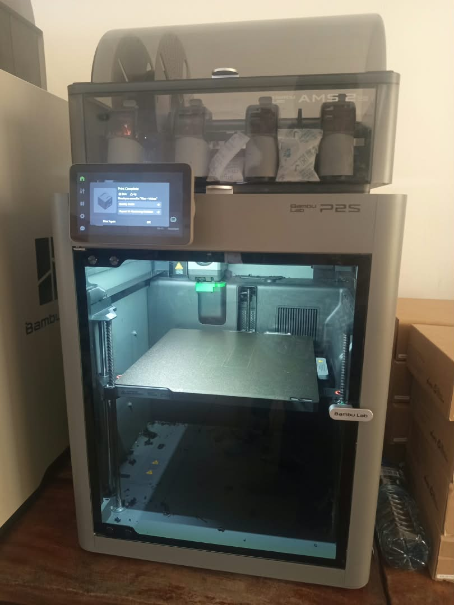
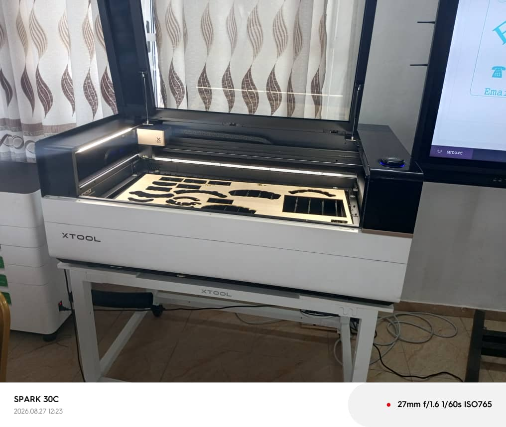

# Journal du mercredi 26 août 2026

**Rédigé par : Nibman SIBITE**

## Fait aujourd'hui

### Atelier de fabrication additive ou d'impression 3D

Aujourd’hui, nous avons abordé :

* l’introduction aux notions fondamentales de l’impression 3D ;

* le procédé de fabrication d’une pièce par impression 3D ;
* les différentes technologies utilisées dans l’impression 3D, telles que la **FDM**, la **SLA** et la **SLS** ;
* les différents matériaux pouvant être utilisés pour l’impression 3D, tels que le **PLA**, le **PETG** et l’**ABS**.

### Atelier des projets

Nous avons étudié :

* la typologie des projets que nous aurons à réaliser ;
* leur importance ;
* leur portée et leur impact potentiel sur la société éducative.

### Atelier de découpage laser

Nous avons abordé :

* la définition et le principe de fonctionnement d’un laser ;
* les différentes machines de découpe laser ;

* leur principe de fonctionnement ;
* l’utilisation d’une machine de découpe laser pour réaliser une découpe sur un matériau.

Nous avons également appris à utiliser le logiciel **xTool** pour concevoir un modèle destiné à la découpe laser.

### Atelier d'électronique

Nous avons étudié :

* les bases de l’électronique ;
* les différents symboles utilisés dans les schémas électroniques ;
* l’utilisation d’un multimètre ;
* la mesure de grandeurs électriques telles que la tension, le courant et la résistance.

## Appris

Aujourd’hui, j’ai appris :

* à comprendre le principe de fonctionnement d’une imprimante 3D ainsi que les différents matériaux utilisés ;
* à choisir des projets ayant un fort impact positif sur la société ;
* à comprendre le principe de fonctionnement des machines de découpe laser ;
* à utiliser le logiciel **xTool** pour concevoir un modèle de découpe ;
* à réaliser une découpe à l’aide d’une machine laser ;
* à utiliser un multimètre ;
* à mesurer différentes grandeurs électriques, notamment la résistance, la tension et le courant.

## Raté, puis corrigé

* Rien de particulier à signaler aujourd’hui.

## Décidé

* Approfondir mes connaissances dans ces différents domaines ;
* mettre progressivement en pratique ces notions et ces compétences dans les FabLabs.

## À faire demain

* Continuer les cours et les travaux pratiques dans les différents ateliers.
