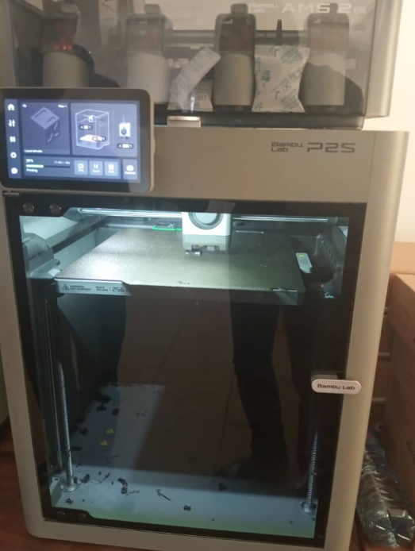
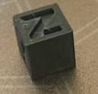
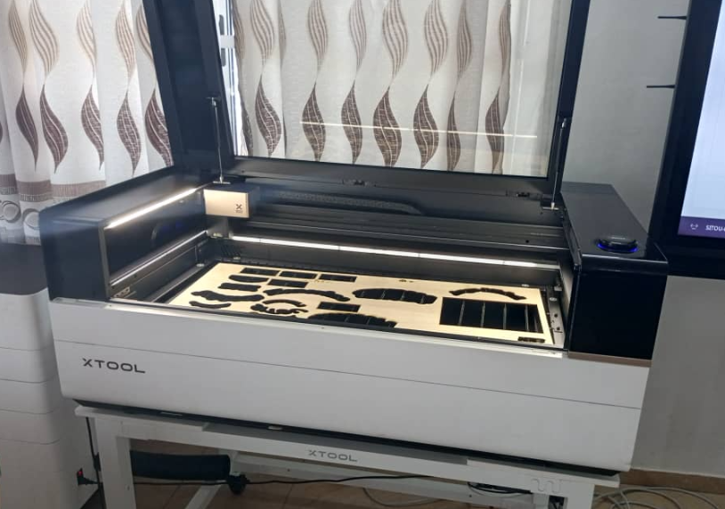
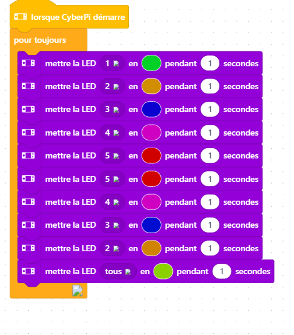

# Journal du jeudi 27 août 2026 
**rédigé par : Nibman Romaric SIBITE**

## Fait aujourd'hui
### Atelier de Fabrication additive ou d'impression 3D
- Instalation, utilisation et parametrage du logiciel de slicing bambu stidio

- impression d'un matérile

### Atelier des Projets
----------------------------------------- 

### Atelier de découpage laser
- Instalation et pratique avec le logiciel xtool pour la concepetion de nos carte de visite.

- Decoupage et gravure sur du bois avec la machine de découpe laser xtool P3

### Atelier d'electronique
- Nous avons vu des notions comme la cyberpi, les capteurs et les actionneurs 
- l'instalation et la programation dans le logiciel mBlock

## Appris

- A convertire un model à imprimé en du G-code en utilisant bambu studio et à imprimé un objet
- A concevoir un model, à découpé et graver en utilisant xtool et une découpe laser
- A programer des cyberpi à l'aide de Mblock des jeux de lumière, des actions à éffectué.

## Raté, puis corrigé

- Rien pour cette journée

## Décidé

- Pratiquer d'avantage afin de consolider des notions apprise.

## À faire demain

- Continué les cours dans les différent attelier 
