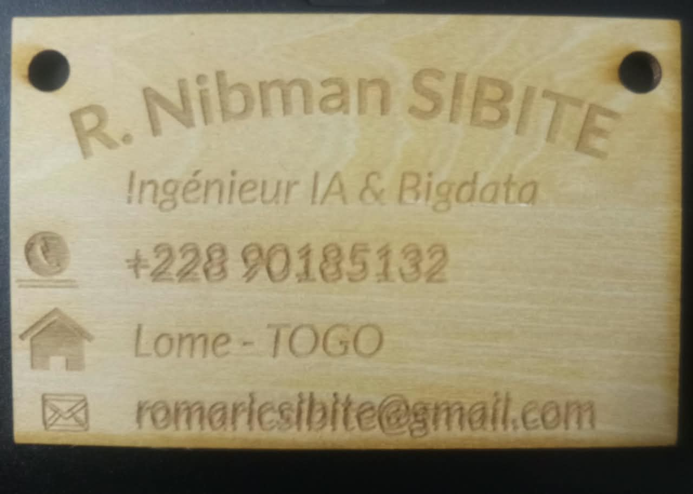

# Journal du jeudi 27 août 2026

**Rédigé par : Nibman Romaric SIBITE**

## Fait aujourd'hui

### Atelier de fabrication additive ou d'impression 3D

* Installation, utilisation et paramétrage du logiciel de *slicing* **Bambu Studio**.
* Impression d’un objet.

### Atelier des projets

* Pas d’activité particulière à signaler dans cet atelier aujourd’hui.

### Atelier de découpage laser

* Installation et prise en main du logiciel **xTool** pour la conception de nos cartes de visite.

* Découpe et gravure sur du bois avec la machine de découpe laser **xTool P3**.

### Atelier d'électronique

* Découverte de notions relatives au **CyberPi**, aux capteurs et aux actionneurs.
* Installation et programmation avec le logiciel **mBlock**.

## Appris

* À convertir un modèle destiné à l’impression en **G-code** à l’aide de Bambu Studio et à imprimer un objet.
* À concevoir un modèle, puis à le découper et le graver à l’aide de **xTool** et d’une machine de découpe laser.
* À programmer un **CyberPi** avec **mBlock** pour réaliser des jeux de lumière et différentes actions.

## Raté, puis corrigé

* Rien à signaler pour cette journée.

## Décidé

* Pratiquer davantage afin de consolider les notions apprises.

## À faire demain

* Continuer les cours et les travaux pratiques dans les différents ateliers.
