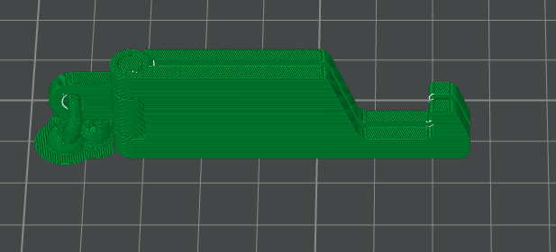

# Journal du jeudi 28 août 2026

**Rédigé par : Nibman Romaric SIBITE**

## Fait aujourd'hui

### Atelier de fabrication additive ou d'impression 3D

* Utilisation et paramétrage du logiciel de **slicing Bambu Studio** afin de préparer un objet pour l'impression 3D.
* Impression d'un support de téléphone.

### Atelier des projets

* Étude de différentes méthodes de gestion de projet, notamment le **Design Thinking** et la **méthode en spirale**.

### Atelier de découpage laser

* Travaux pratiques de gravure et de découpe avec les machines laser.

### Atelier d'électronique

* Réalisation de travaux pratiques avec des équipements électroniques tels que le **CyberPi** et le **capteur de lumière (Light Sensor)**.

## Appris

* À ajouter des supports et à positionner correctement un modèle sur le plateau avant de lancer une impression 3D.
* À programmer des feux tricolores et des jeux de lumière avec des équipements électroniques.
* À gérer un projet en utilisant les **cinq principes du Design Thinking** ainsi que la **méthode en spirale**.

## Raté, puis corrigé

* En électronique, j'ai rencontré des difficultés avec le code de certains travaux pratiques réalisés sur **mBlock**. J'ai ensuite corrigé mes erreurs grâce aux explications du formateur.

## Décidé

* Utiliser les méthodes du **Design Thinking** et de la **méthode en spirale** pour la réalisation de notre projet intégrateur.

## À faire demain

* Choisir et relever le challenge lié aux sujets de projets.
