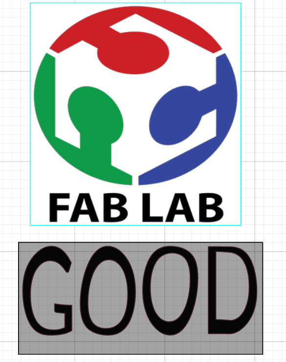

# Journal du mardi 1er septembre 2026

**Rédigé par : Nibman Romaric SIBITE**

## Fait aujourd'hui

### Atelier de conception et de modélisation 3D

* Utilisation du logiciel **Fusion 360** pour concevoir plusieurs formes distinctes en utilisant différentes fonctionnalités.

* Conception de modèles personnalisés, tels qu’un **porte-clés**, à l’aide de Fusion 360.

### Atelier de découpage laser

* Nous avons suivi un cours sur le **DTF (Direct to Film)** et réalisé des travaux pratiques consistant à concevoir différentes images.

### Atelier d'électronique

* Découverte du fonctionnement de la **breadboard SK10** ainsi que de son utilisation pour réaliser des circuits électroniques.

## Appris

* À manipuler **Fusion 360** et à utiliser différentes fonctions de modélisation, telles que l’**extrusion** et la **révolution**.
* À concevoir des affiches personnalisées pouvant être imprimées et transférées sur des T-shirts.
* À utiliser une **breadboard SK10** pour réaliser le branchement de circuits électroniques.

## Raté, puis corrigé

* Rien de particulier aujourd’hui.

## Décidé

* Faire davantage de travaux pratiques afin de mieux maîtriser **Fusion 360**.

## À faire demain

* Continuer les travaux pratiques dans les différents ateliers.
