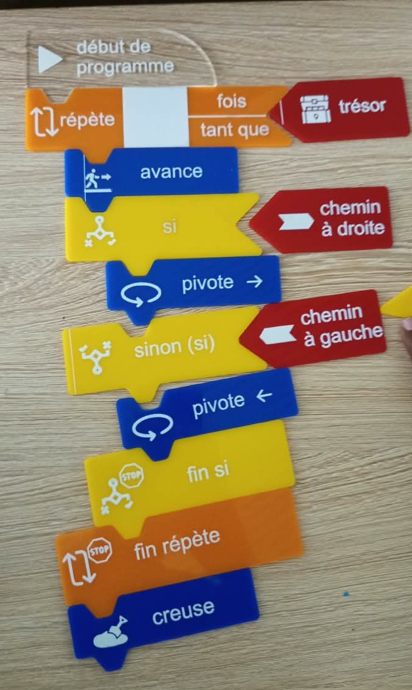
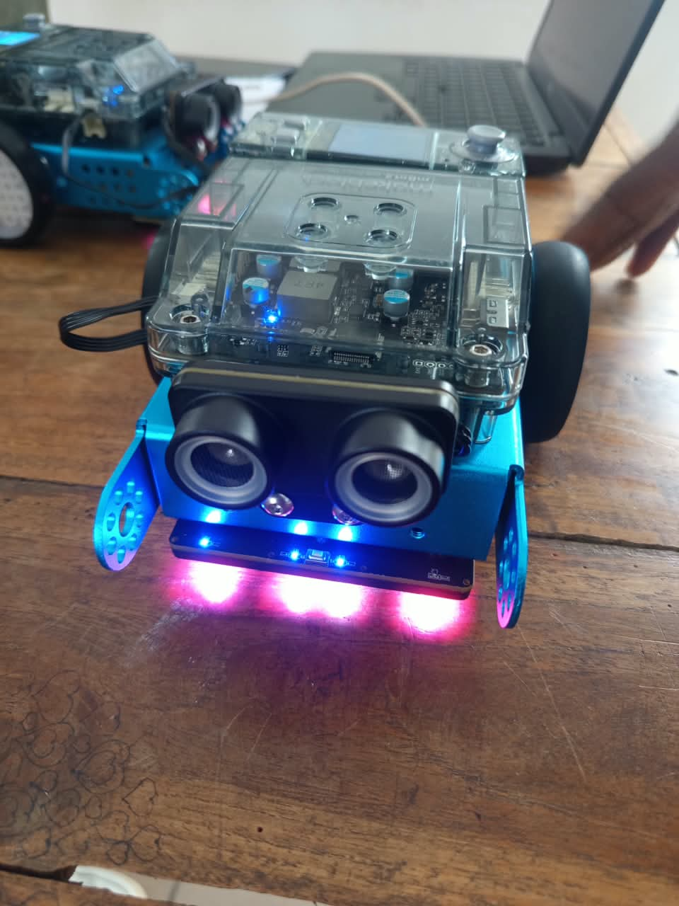

# Journal du mardi 2 septembre 2026

**Rédigé par : Nibman Romaric SIBITE**

## Fait aujourd'hui

### Atelier projet

* Travail en équipe, réflexion et réalisation d’une esquisse de notre solution technique pour notre projet de **détection du niveau d’eau**.

### Atelier de découpage laser

* Cours sur l’**algorithmique débranchée**.
* Réalisation d’un exercice pratique sur l’algorithmique débranchée.

### Atelier d'électronique

* Montage et programmation d’un robot équipé d’un **capteur à ultrasons**.

## Appris

* Ce qu’est l’**algorithmique débranchée** et son principe.
* À réaliser une esquisse d’un **système électronique**.
* À monter et programmer un robot en tenant compte de plusieurs contraintes.

## Raté, puis corrigé

* Rien de particulier aujourd’hui.

## Décidé

* Faire davantage de travaux pratiques afin de mieux maîtriser les différentes notions étudiées.

## À faire demain

* Continuer les travaux pratiques dans les différents ateliers.
