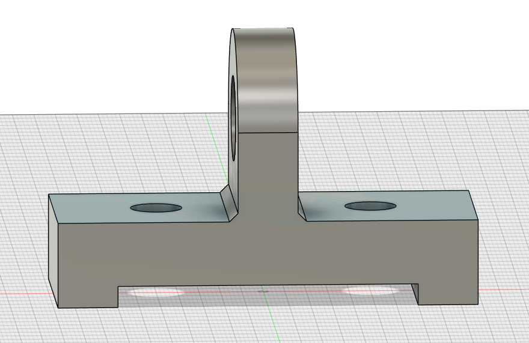
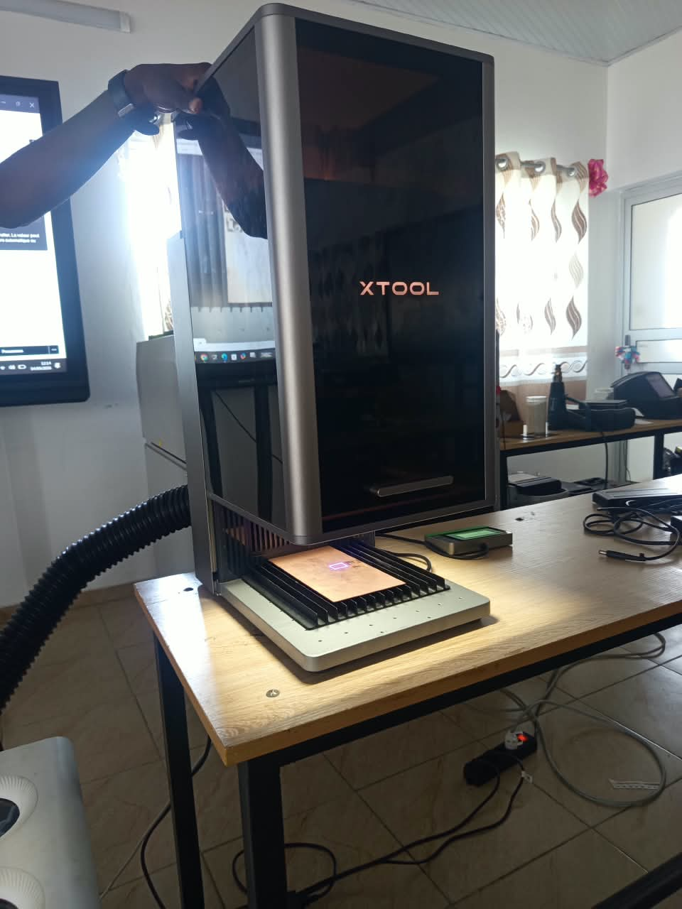

# Journal du vendredi 4 septembre 2026

**Rédigé par : Nibman Romaric SIBITE**

## Fait aujourd'hui

### Atelier de fabrication additive, d'impression 3D et de modélisation

* Réalisation de travaux pratiques de modélisation avec **Fusion 360**, à partir de dessins techniques.

### Cours sur le langage Python

* Étude des **structures de données**, telles que les listes, les tuples et les dictionnaires.
* Étude des **structures de contrôle** : `if`, `else`, `elif`.
* Étude des **boucles** : `for`, `while`.
* Réalisation d’exercices pratiques.

### Atelier d'électronique

* Cours sur le processus de fabrication des **circuits imprimés (PCB)**.
* Exemple pratique de fabrication d’un PCB à l’aide de **xTool** et d’une machine de découpe laser.

## Appris

* À utiliser de nouvelles fonctions et méthodes de **Fusion 360** pour modéliser une même pièce en 3D de différentes manières.
* À comprendre ce qu’est un **PCB (Printed Circuit Board)**.
* À connaître les différentes méthodes et étapes de fabrication d’un PCB.
* À comprendre l’utilité d’un PCB dans un circuit électronique.
* À programmer en **Python** en utilisant les structures de contrôle et les boucles.
* À manipuler les structures de données en Python, notamment en ajoutant, supprimant et modifiant des éléments.

## Raté, puis corrigé

* J’ai rencontré des difficultés lors de la modélisation d’une pièce en 3D.

## Décidé

* Pratiquer davantage afin de consolider les notions apprises et d’améliorer ma maîtrise des différents outils.

## À faire demain

* Continuer les cours et les travaux pratiques dans les différents ateliers.
