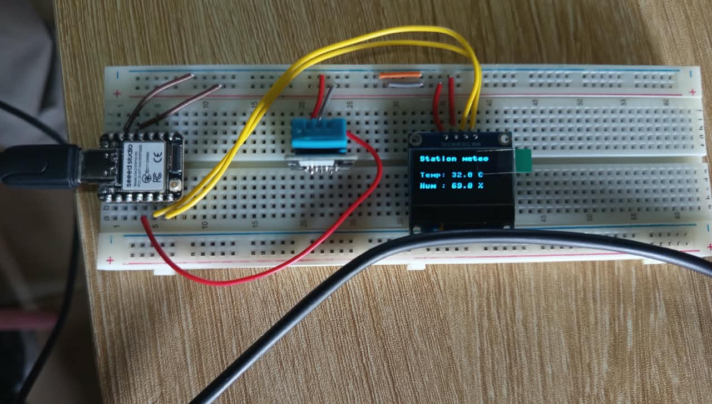

# Journal du samedi 5 septembre 2026

**Rédigé par : Nibman Romaric SIBITE**

## Fait aujourd'hui

### Montage d'une station météorologique

* Cours sur le montage d'une station météorologique à l'aide d'un microcontrôleur **XIAO ESP32-S3**, d'un capteur **DHT22** et d'un écran d'affichage **OLED**.

## Appris

* À utiliser différentes composantes électroniques afin de mener un projet à bien.

* À monter l'**ESP32-S3**, le capteur **DHT22** et l'écran **OLED** sur une plaquette d'essai **SK10**.

* À lire les différentes broches des composants et à connaître leur utilité.

* À connecter l'**ESP32-S3** à mon IDE **Thonny**.

* À programmer en **MicroPython** et à transférer le programme sur l'**ESP32-S3**.

## Raté, puis corrigé

* Rien de particulier aujourd'hui.

## Décidé

* Faire davantage de travaux pratiques afin de mieux maîtriser les différentes notions étudiées.

## À faire demain

* Continuer les travaux pratiques dans les différents ateliers.
