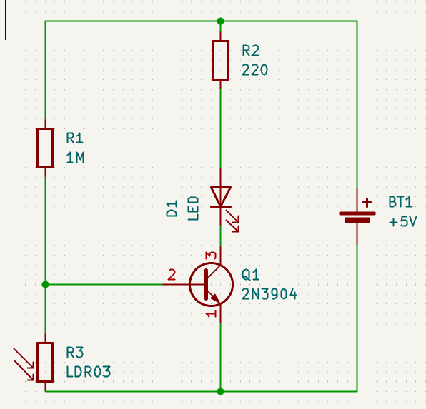
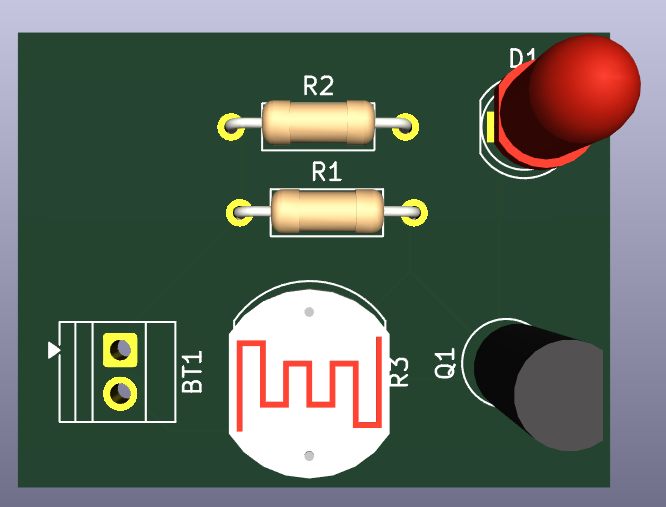
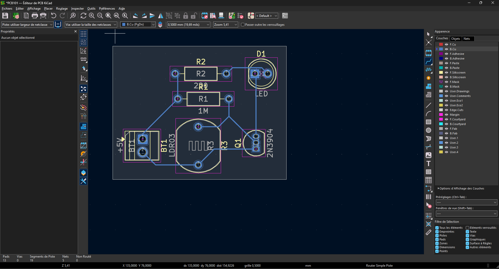
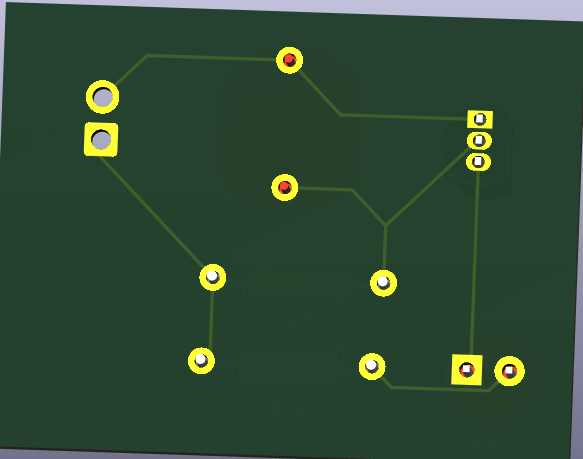

# Journal du lundi 7 septembre 2026

**Rédigé par : Nibman Romaric SIBITE**

## Fait aujourd'hui

### Cours d'initiation aux PCB

* Cours d'initiation aux **PCB (Printed Circuit Boards)**.
* Conception de circuits avec **KiCad**.
* Installation et prise en main du logiciel **KiCad**.
* Travaux pratiques dans le logiciel **KiCad**.

## Appris

* À comprendre ce qu'est un **PCB**.

* Les différentes raisons pour lesquelles on doit passer d'un prototype à un PCB.

* L'anatomie d'un PCB.

* Les différentes étapes de conception d'un PCB.

* À passer d'un schéma réalisé sur papier à la conception d'un circuit dans **KiCad**.

* À utiliser **KiCad** pour choisir les différents composants de notre circuit, définir leurs paramètres, les connecter et tracer les pistes afin de réaliser le circuit.

* Quelques étapes de notre séance de travaux pratiques :

**Première étape : conception du circuit**

**Deuxième étape : après le paramétrage des différents composants, visualisation des composants sur la carte**

**Troisième étape : traçage des différentes pistes sur la carte**

**Quatrième étape : visualisation des pistes sur la carte**

## Raté, puis corrigé

* Rien de particulier aujourd'hui.

## Décidé

* Faire davantage de travaux pratiques afin de mieux maîtriser les différentes notions étudiées.

## À faire demain

* Continuer les travaux pratiques sur les différents logiciels et avancer sur notre projet intégrateur.
