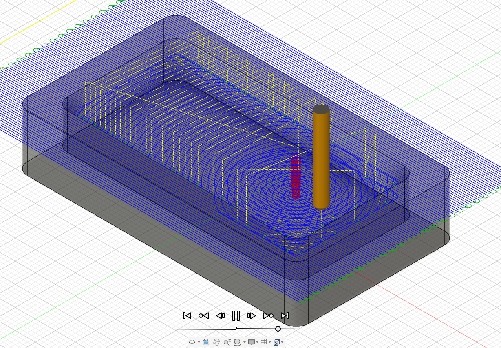
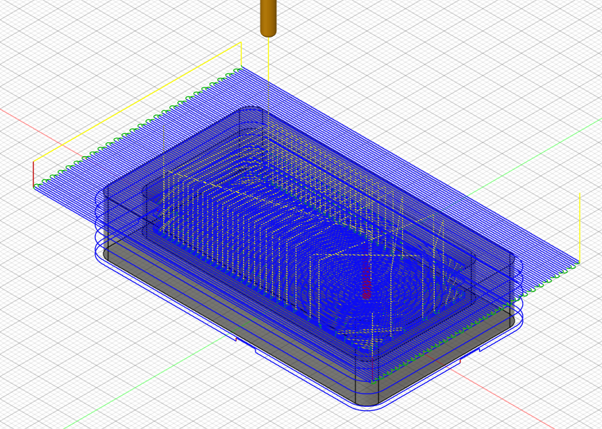

# Journal du mardi 8 septembre 2026

**Rédigé par : Nibman Romaric SIBITE**

## Fait aujourd'hui

* Réflexion sur l'agencement des différents composants, leurs connexions et la conception schématique du circuit de notre système de détection du niveau d'eau.

* Cours sur la **FAO (Fabrication Assistée par Ordinateur)**, suivi d'un TP sur le logiciel **Fusion 360**.

## Appris

* La définition de concepts tels que la **FAO**, la **CNC** et la **CAO**.
* Les différentes machines utilisées en **CNC**.
* Le flux de travail de la **FAO dans Fusion 360**.
* À réaliser une opération de FAO avec Fusion 360, de la modélisation jusqu'à la simulation de fabrication.
* À paramétrer Fusion 360 pour obtenir une fabrication optimale.
* À générer et télécharger le **G-code** de l'objet à fabriquer.
* Quelques étapes de notre TP d'aujourd'hui :

**Pendant la simulation de la fabrication de notre pièce**

**Fin de la simulation de la fabrication de notre pièce**

## Raté, puis corrigé

* Rien de particulier à signaler pour cette journée.

## Décidé

* Faire davantage d'exercices et de travaux pratiques afin de mieux maîtriser la **FAO**.

## À faire demain

* Continuer les travaux pratiques dans les différents ateliers et avancer sur nos projets intégrateurs.
