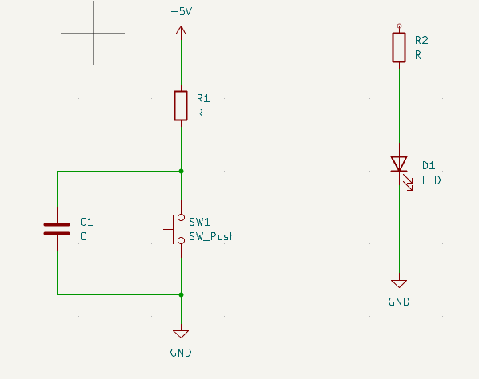
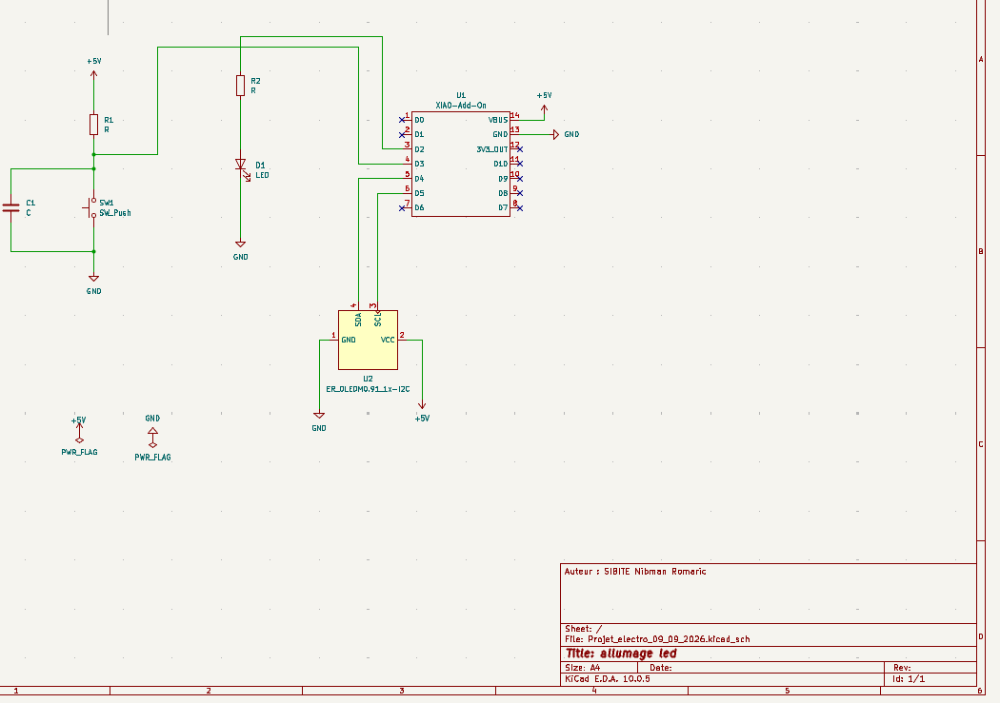
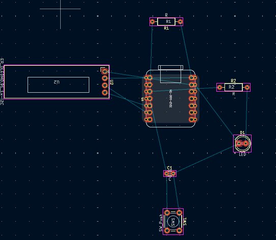
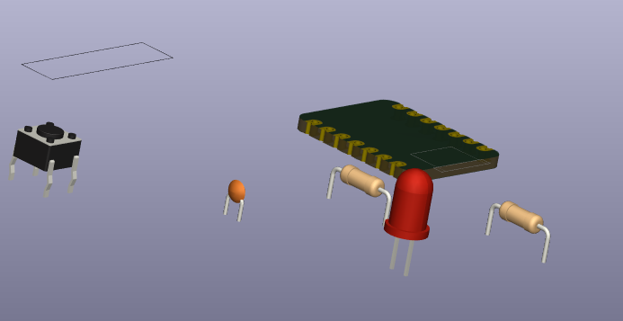

# Journal du mercredi 9 septembre 2026

**Rédigé par : Nibman Romaric SIBITE**

## Fait aujourd'hui

* Projet d'électronique sur l'allumage d'une LED, en partant du schéma électrique avec les différents composants, en passant par la conception du PCB dans **KiCad**, puis par la programmation qui sera envoyée sur le microcontrôleur.

## Appris

* À utiliser **KiCad** de manière plus approfondie.
* À importer des bibliothèques qui ne sont pas disponibles par défaut dans KiCad.
* À créer le symbole et l'empreinte d'un écran **OLED** qui ne sont pas disponibles par défaut dans KiCad.
* À assigner les empreintes aux différents composants.
* Les fondamentaux de la programmation.
* À programmer en **MicroPython**.
* Plusieurs concepts et définitions liés au domaine de l'informatique.
* Quelques étapes de notre projet d'aujourd'hui, nommé **« Allumage LED »** :

**Début de la conception du schéma électrique**

**Fin de la conception du schéma et de l'assignation des empreintes**

**Édition du PCB**

**Vue en 3D de notre PCB en cours d'édition**

## Raté, puis corrigé

* Rien de particulier à signaler pour cette journée.

## Décidé

* Continuer le projet à la maison afin de le faire avancer.

## À faire demain

* Travailler sur nos projets intégrateurs.
