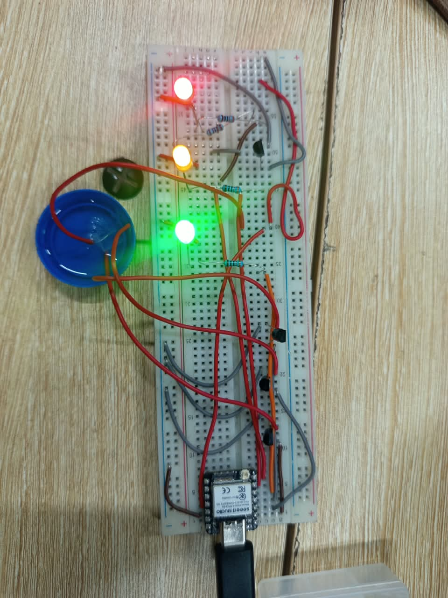

# Journal du jeudi 10 septembre 2026

**Rédigé par : Nibman Romaric SIBITE**

## Fait aujourd'hui

* Nous avons essentiellement travaillé à faire avancer nos projets intégrateurs en récupérant le matériel disponible et en effectuant différents tests avec celui-ci.

## Appris

* À réaliser un circuit sur une plaquette d'essai **SK10** de bout en bout.
* À associer le code nécessaire au fonctionnement de notre circuit et à l'adapter en fonction de nos besoins.
* À travailler en groupe et à prendre en compte l'avis de tous les membres.

**Montage de notre circuit sur une breadboard**

## Raté, puis corrigé

* Le code Python qui permet de faire fonctionner notre système.

## Décidé

* Continuer le projet à la maison afin de le faire avancer.

## À faire demain

* Travailler sur nos projets intégrateurs.
