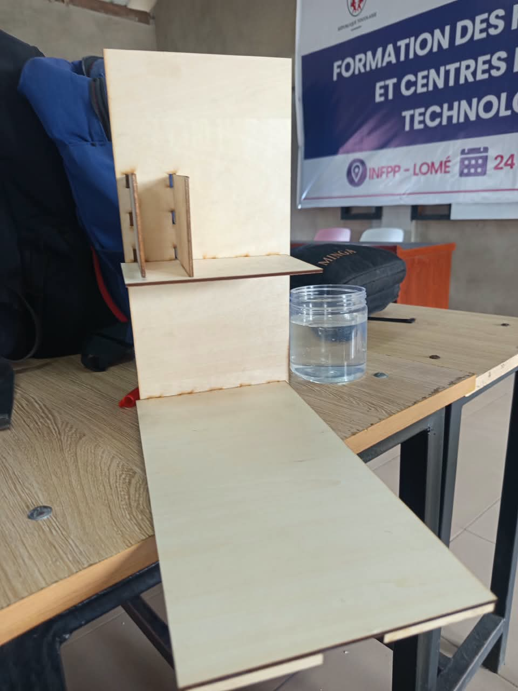
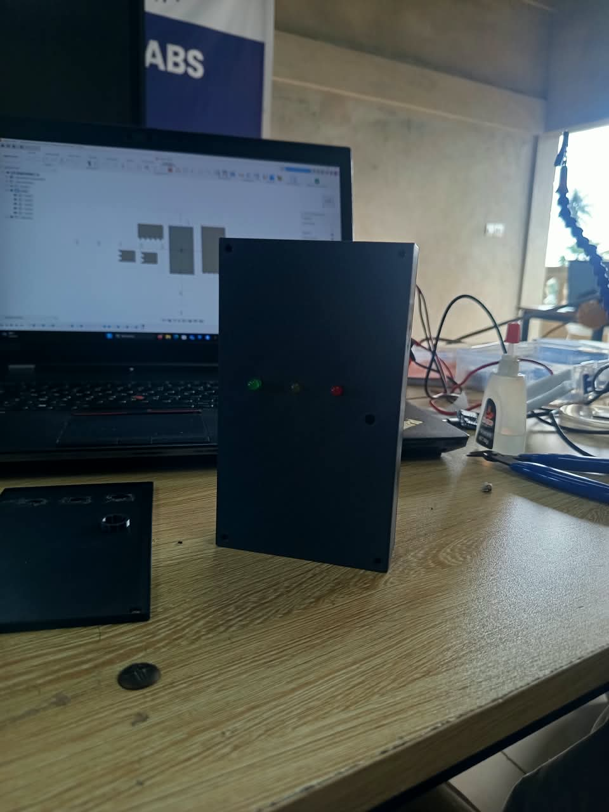
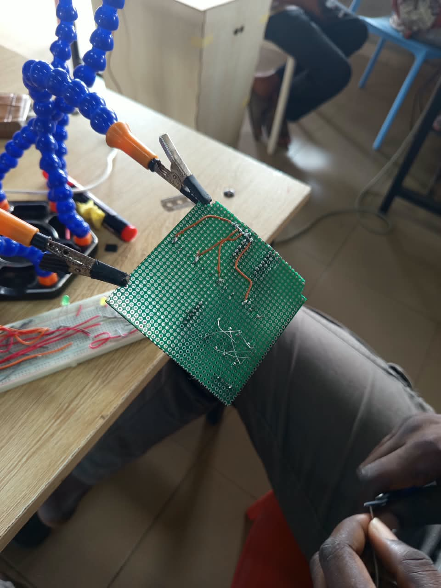
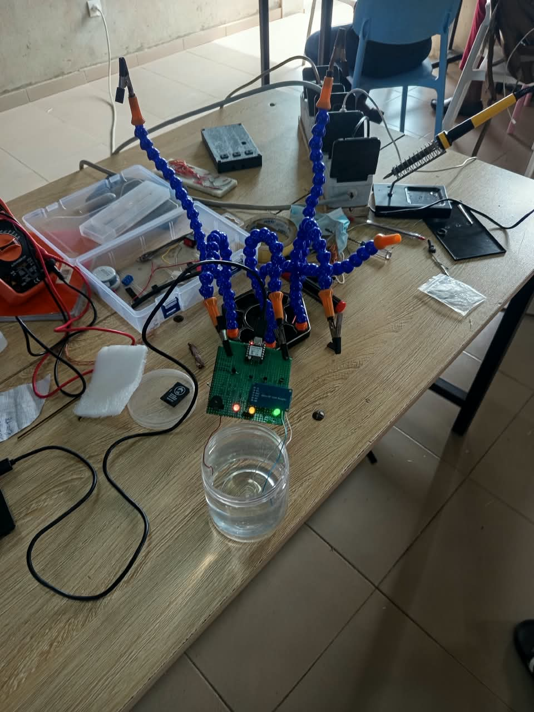

# Journal du mercredi 16 septembre 2026

**Rédigé par : Nibman Romaric SIBITE**

## Fait aujourd'hui

* Travail en groupe sur notre projet :

### Conception du support du système

### Modélisation d'une nouvelle version du boîtier

### Montage du circuit sur une plaquette perforée

### Test du circuit après montage

## Appris

* À réaliser des soudures sur une **plaquette perforée**.
* À effectuer des tests de connectivité et des mesures de tension à l'aide d'un **multimètre**.

## Raté, puis corrigé

* La modélisation du boîtier dans lequel nous allons loger notre système.

## Décidé

* Finaliser le projet demain afin de pouvoir le présenter vendredi.

## À faire demain

* Modéliser notre boîtier et finaliser notre système de détection du niveau d'eau.
